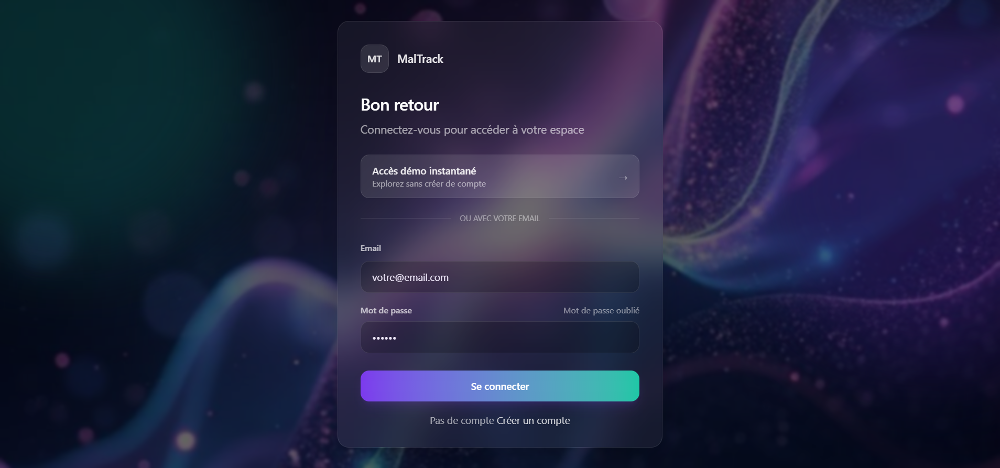
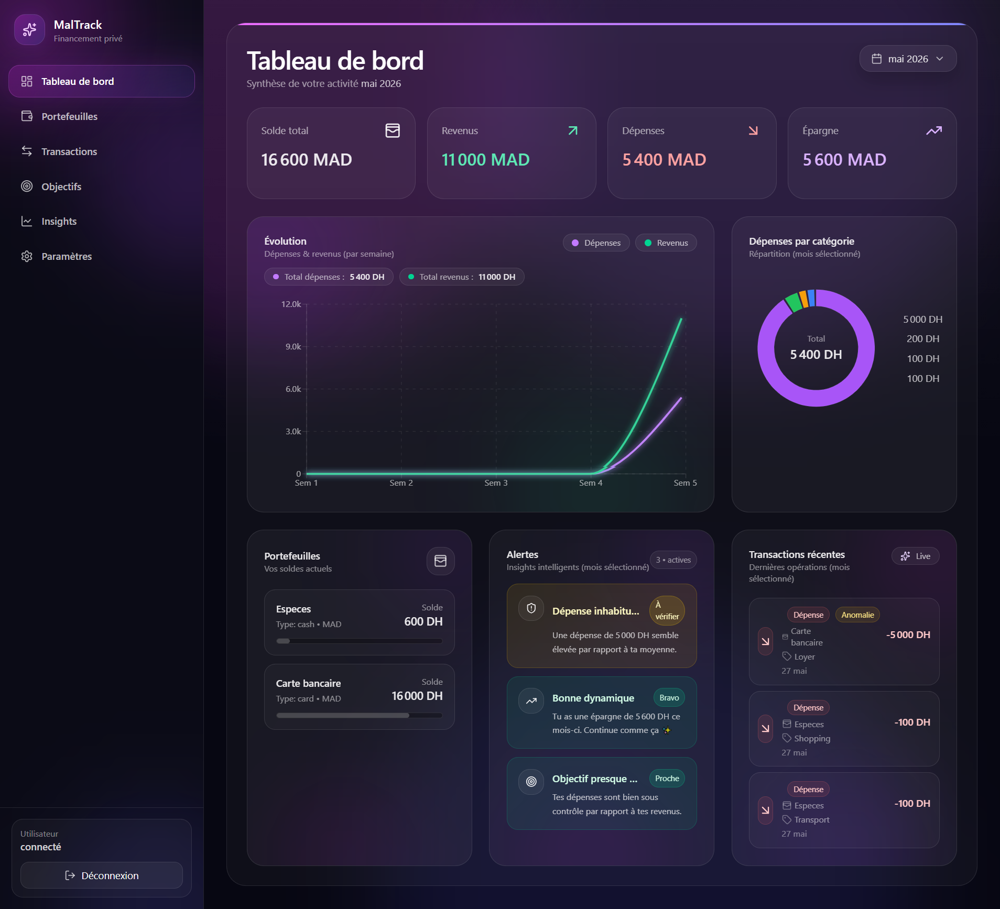
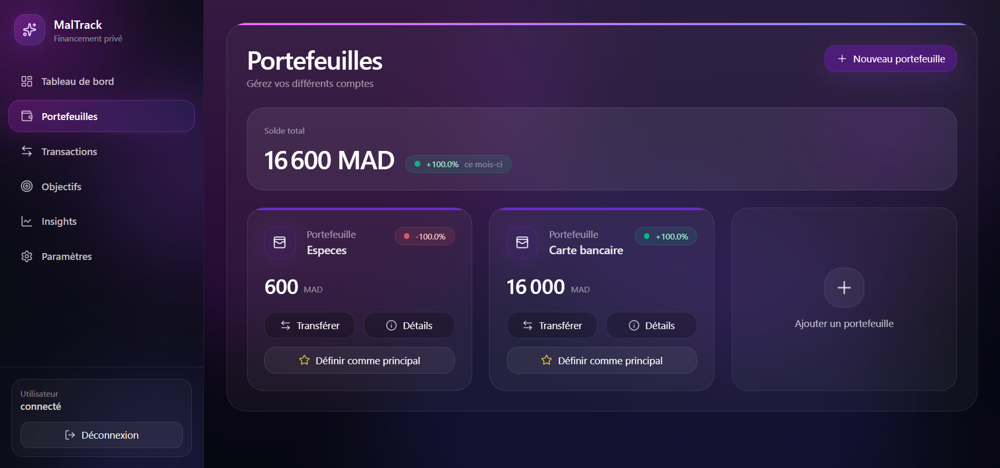
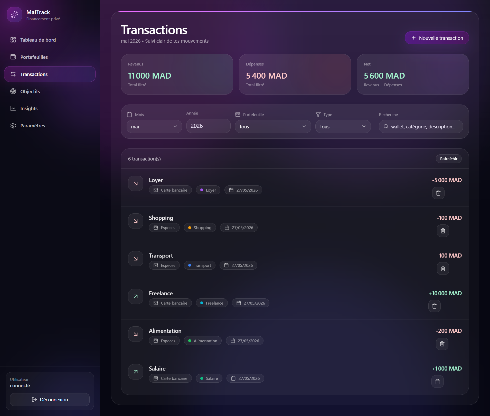
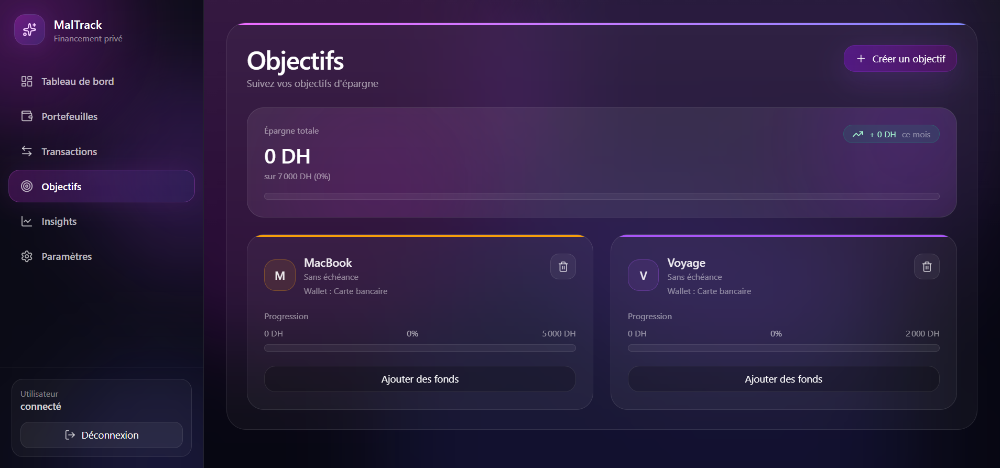

# MalTrack Finance 💸

Modern personal finance dashboard built with React, Node.js and MongoDB.

MalTrack helps users manage wallets, track transactions, monitor savings goals and visualize financial insights through a premium banking-style interface.

---

# ✨ Features

- 🔐 Secure JWT Authentication
- 💳 Wallet Management
- 📈 Financial Insights & Analytics
- 💸 Transaction Tracking
- 🎯 Savings Goals
- 📊 Interactive Charts
- 📱 Responsive Dashboard
- 🌙 Modern Banking UI
- 🛡 Protected Routes
- ⚡ Fast React + Vite Frontend

---

# 🖼 Screenshots

## Login


## Dashboard


## Wallets


## Transactions


## Goals


---

# 🛠 Tech Stack

## Frontend
- React
- Vite
- React Router
- TailwindCSS
- Recharts
- Lucide React

## Backend
- Node.js
- Express.js
- MongoDB
- Mongoose
- JWT Authentication
- bcryptjs

---

# 📂 Project Structure

```bash
maltrack-finance/
│
├── frontend/
│   ├── src/
│   ├── public/
│   └── package.json
│
├── backend/
│   ├── src/
│   ├── routes/
│   ├── models/
│   └── package.json
│
├── docs/
│   └── screenshots/
│
├── README.md
└── SPEC.md
```

---

# 🚀 Installation

## 1. Clone Repository

```bash
git clone https://github.com/SalmaEzzer/maltrack-finance.git
cd maltrack-finance
```

---

# ⚙ Backend Setup

```bash
cd backend
npm install
```

Create `.env` file:

```env
PORT=5000
MONGO_URI=your_mongodb_connection
JWT_SECRET=your_secret_key
```

Run backend:

```bash
npm run dev
```

---

# 💻 Frontend Setup

```bash
cd frontend
npm install
npm run dev
```

---

# 🔑 Main API Routes

```bash
/api/auth
/api/wallets
/api/transactions
/api/goals
/api/insights
```

---

# 🌍 Deployment

Frontend:
- Vercel

Backend:
- Render

Database:
- MongoDB Atlas

---

# 📌 Roadmap

- [ ] Dark / Light Mode
- [ ] Notifications System
- [ ] Budget Planner
- [ ] AI Financial Insights
- [ ] Export Reports
- [ ] Mobile App Version
- [ ] Multi-Currency Support

---

# 👩‍💻 Author

Developed by Salma Ezzerrouti.

GitHub:
https://github.com/SalmaEzzer

---

# ⭐ Project Vision

MalTrack aims to deliver a modern digital banking experience focused on simplicity, financial awareness and premium user experience.
