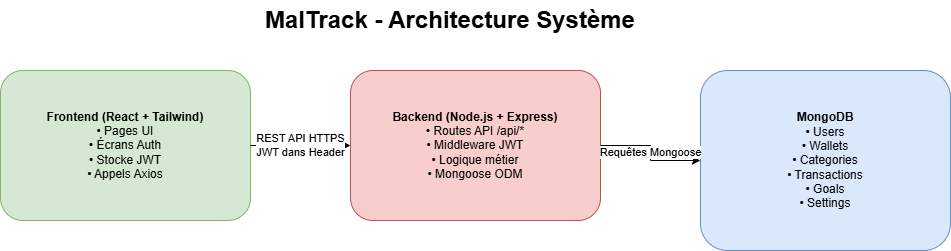
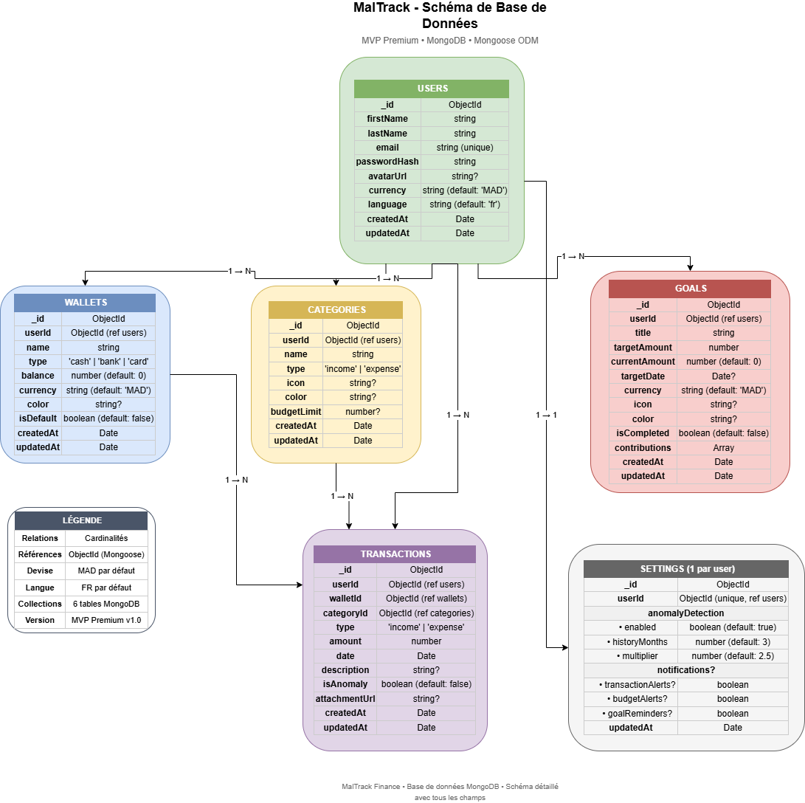

# 📊 Diagrammes d'architecture - MalTrack

Ce diagramme présente l’architecture globale de l’application MalTrack basée sur une approche client–serveur.

Ce dossier contient les diagrammes d'architecture du projet MalTrack.

## 📁 Fichiers

### architecture.png

**Description** : Diagramme d'architecture globale montrant les 3 composants principaux du système.

**Composants** :
1. **Frontend** - React + Tailwind CSS
   - Interface utilisateur
   - Authentification (Login/Register)
   - Stockage du token JWT
   - Appels API

2. **Backend** - Node.js + Express
   - Routes API REST (/api/*)
   - Middleware JWT
   - Logique métier
   - Connexion MongoDB via Mongoose

3. **Database (NoSQL)** - MongoDB
   - Users (utilisateurs)
   - Wallets (portefeuilles)
   - Categories (catégories)
   - Transactions
   - Goals (objectifs)
   - Settings (paramètres)

**Flux** :
- Frontend → Backend : HTTP avec JWT
- Backend → MongoDB : Requêtes Mongoose

## 🛠️ Technologies

| Composant | Technologies |
|-----------|--------------|
| Frontend | React, Tailwind CSS, Axios |
| Backend | Node.js, Express, JWT |
| Database | MongoDB, Mongoose |
| Authentification | JWT, bcryptjs |

## 📋 Informations
- **Date création** : 25 décembre 2025
- **Format** : PNG
- **Statut** : ✅ Complet

## 🗄️ Schéma de base de données

### db-schema.png

Ce schéma représente la conception de la base de données MongoDB du projet MalTrack.

Il définit :
- Les collections principales (Users, Wallets, Transactions, Categories, Goals, Settings)
- Les champs clés de chaque collection
- Les relations entre les entités (1→N, 1→1)

Ce schéma sert de référence pour l’implémentation des modèles Mongoose côté backend.

Ce schéma correspond à la version MVP Premium v1.0 et pourra évoluer avec l’ajout de fonctionnalités avancées.

---
*Documentation de l'architecture système MalTrack*
