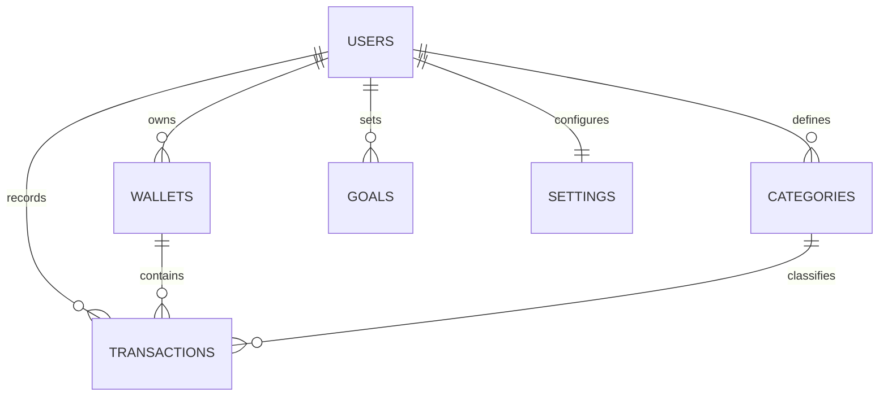

# 🗂️ Diagramme des collections – MalTrack

```mermaid
erDiagram
    USERS ||--o{ WALLETS : owns
    USERS ||--o{ CATEGORIES : defines
    USERS ||--o{ TRANSACTIONS : records
    USERS ||--o{ GOALS : sets
    USERS ||--|| SETTINGS : configures

    WALLETS ||--o{ TRANSACTIONS : contains
    CATEGORIES ||--o{ TRANSACTIONS : classifies
```